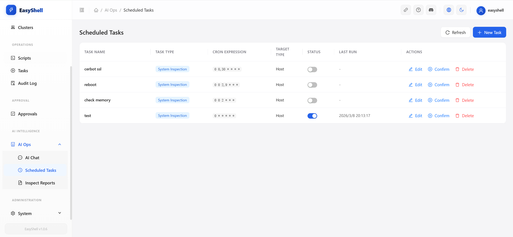

<p align="center">
  
</p>

# EasyShell

**AI 原生伺服器運維平台**

讓 AI 為您撰寫腳本、編排多機任務並分析基礎設施 —— 您只需專注於核心決策。

[](./LICENSE)
[](https://docs.easyshell.ai)
[](https://discord.gg/WqFD9VQe)

**語言**: [English](./README.md) | [简体中文](./README.zh-CN.md) | 繁體中文 | [한국어](./README.ko.md) | [Русский](./README.ru.md) | [日本語](./README.ja.md)

---

## 為什麼選擇 EasyShell？

傳統的伺服器管理工具需要您親自撰寫每個腳本、手動 SSH 進入每台機器，並自行解讀所有輸出結果。EasyShell 翻轉了這個模式：**AI 是操作員，您是決策者。**

- **用自然語言描述您的需求** → AI 撰寫生產環境等級的 Shell 腳本，並提供差異比對（diff）審核
- **設定多機協作目標** → AI 規劃執行步驟、自動執行並彙整產出結果
- **設定定時巡檢任務** → AI 分析輸出結果並自主決策是否透過機器人頻道告警通知團隊
- **透過 Web SSH 連線** → 完整終端機整合檔案管理員、多標籤頁與搜尋功能 —— 無需安裝在地端用戶端

---

## 核心功能

### 1. AI 腳本助手

> 描述您的需求。AI 撰寫腳本。審核差異。一鍵套用。

AI 腳本工作台是一個雙面板編輯器，您可以用自然語言描述需求，AI 會針對您選擇的作業系統生成（或修改）Shell 腳本。即時串流顯示腳本撰寫過程，內建的差異檢視器會標示出變動之處，摘要分頁則會以您的語言解釋修改內容。

<p align="center">
  
</p>

**運作方式：**
1. **描述** —— 用自然語言描述需求，選擇目標作業系統
2. **生成** —— AI 即時串流生成生產環境等級的腳本
3. **審核** —— 內建差異檢視器標示所有變動；摘要分頁解釋修改內容
4. **套用** —— 一鍵儲存至腳本庫或立即下發執行

### 2. AI 任務編排

> 「檢查所有主機的磁碟與記憶體，標記任何超過 80% 的項目，並建議修復方案。」—— 完成。

AI 對話介面讓您能下達高層級的運維目標。AI 會將目標分解為多步驟執行計畫（探索 → 分析 → 報告），將腳本分發至目標主機，收集結果，並在單次對話中提供包含風險評估與行動建議的結構化分析。

<p align="center">
  
</p>

**運作方式：**
1. **指令** —— 在 AI 對話中描述高層級運維目標（如「檢查所有主機磁碟使用率」）
2. **規劃** —— AI 將目標拆解為多步驟執行計畫（探索 → 分析 → 報告）
3. **執行** —— 腳本並行分發至目標主機，結果自動收集
4. **報告** —— AI 生成包含風險評估與行動建議的結構化分析報告

### 3. AI 定時巡檢

> **定時任務 → 腳本執行 → AI 智慧分析 → 智能告警** —— AI 分析輸出結果並自主決策是否告警。

透過 Cron 運算式排程巡檢任務，並從內建腳本庫中選擇腳本。EasyShell 按排程將腳本分發至 Agent，收集輸出結果（磁碟、記憶體、服務、日誌），發送至 AI 模型進行智慧分析，**由 AI 判斷是否需要告警** —— 只在真正需要關注時才推送通知。

<p align="center">
  
</p>

**運作方式：**
1. **設定** —— Cron 運算式 + 腳本（從腳本庫選擇或自訂）+ AI 分析提示詞 + 通知規則
2. **執行** —— EasyShell 按排程將任務分發至目標 Agent
3. **分析** —— 輸出結果發送至 AI 模型（OpenAI / Gemini / GitHub Copilot / 自訂）進行智慧分析
4. **通知** —— AI 評估嚴重程度，在需要時透過機器人頻道推送告警

**通知模式：** 始終推送、失敗時推送、警告時推送、或 **AI 自主決策** —— AI 模型評估輸出內容並自主判斷是否需要告警。

**支援的機器人頻道** ([設定指南](https://docs.easyshell.ai/configuration/bot-channels/)):

| 機器人 | 狀態 |
|-----|--------|
| [Telegram](https://docs.easyshell.ai/configuration/bot-channels/) | ✅ 已支援 |
| [Discord](https://docs.easyshell.ai/configuration/bot-channels/) | ✅ 已支援 |
| [Slack](https://docs.easyshell.ai/configuration/bot-channels/) | ✅ 已支援 |
| [釘釘 (DingTalk)](https://docs.easyshell.ai/configuration/bot-channels/) | ✅ 已支援 |
| [飛書 (Feishu)](https://docs.easyshell.ai/configuration/bot-channels/) | ✅ 已支援 |
| [企業微信 (WeCom)](https://docs.easyshell.ai/configuration/bot-channels/) | ✅ 已支援 |

### 4. 全功能 Web SSH

> 真實終端。整合檔案管理。無需 SSH 用戶端。

生產等級的網頁終端機，支援多標籤頁工作階段、整合式檔案管理員（上傳、下載、建立、刪除、瀏覽）、終端機緩衝區全文搜尋，並透過 WebSocket 維持穩定連線。讓您能併排管理檔案與執行指令。

<p align="center">
  
</p>

### 5. 主機管理與監控

> 統一檢視所有伺服器的即時狀態，支援批次操作和 Agent 生命週期管理。

單獨或批次管理主機 —— 透過表單或 CSV 匯入新增、依叢集組織、監控連線狀態，一鍵部署/升級 Agent。統一儀表板讓健康指標一目瞭然。

<p align="center">
  
</p>

### 6. 即時串流日誌

> 即時觀察腳本在所有目標主機上的執行過程。

當您下發腳本時，EasyShell 會從每個 Agent 即時串流輸出內容。彩色日誌、時間戳記和依主機篩選功能，讓您能立即發現問題 —— 無需再等待批次任務完成。

<p align="center">
  
</p>

### 7. 安全與風控

> 內建安全機制：審批流程、稽核追蹤和操作限制。

設定哪些操作在執行前需要審批。所有操作都會被記錄以符合合規要求。基於角色的存取控制限制「誰可以做什麼」，敏感命令可以被標記或完全禁止。

<p align="center">
  
</p>

---

## 快速開始

```bash
git clone https://github.com/easyshell-ai/easyshell.git
cd easyshell
cp .env.example .env      # 按需編輯 .env
docker compose up -d
```

無需本地端建構 —— 系統會自動從 [Docker Hub](https://hub.docker.com/u/laolupaojiao) 拉取預建構的映像檔。

開啟 `http://localhost:18880` → 使用 `easyshell` / `easyshell@changeme` 登入。

> **想改用 GHCR？** 在 `.env` 中設定：
> ```
> EASYSHELL_SERVER_IMAGE=ghcr.io/easyshell-ai/easyshell/easyshell-server:latest
> EASYSHELL_WEB_IMAGE=ghcr.io/easyshell-ai/easyshell/easyshell-web:latest
> ```

> **開發者？從原始碼建構：**
> ```bash
> docker compose -f docker-compose.build.yml up -d
> ```

---

## 完整功能集

| 類別 | 功能 |
|----------|----------|
| **AI 智慧** | AI 腳本助手（生成 / 修改 / 差異比對 / 摘要）、AI 任務編排（多步驟計畫、並行執行、分析）、AI 定時巡檢（Cron 定時、AI 輸出分析、智能告警決策、多頻道機器人推送）、AI 對話、巡檢報告、操作審批 |
| **運維操作** | 腳本庫、批次執行、即時串流日誌、整合檔案管理員的 Web SSH 終端機 |
| **基礎設施** | 主機管理、即時監控、叢集分組、Agent 自動部署 |
| **系統管理** | 使用者管理、系統設定、AI 模型設定（OpenAI / Gemini / Copilot / 自訂）、風險控制 |
| **平台特性** | 多語系（英 / 中）、深色/淺色主題、響應式設計、審計日誌 |

---

## 系統架構

```
┌──────────────┐       HTTP/WS        ┌──────────────────┐
│  EasyShell   │◄─────────────────────►│   EasyShell      │
│    Agent     │  註冊 / 心跳跳動      │      伺服器      │
│  (Go 1.24)  │  腳本執行 / 日誌     │ (Spring Boot 3.5)│
└──────────────┘                       └────────┬─────────┘
                                                │
                                       ┌────────┴─────────┐
                                       │   EasyShell Web   │
                                       │ (React + Ant Design)│
                                       └──────────────────┘
```

## 技術棧

| 組件 | 技術 |
|-----------|-----------|
| 伺服器 | Java 17, Spring Boot 3.5, Gradle, JPA/Hibernate, Spring AI, Spring Security |
| Agent | Go 1.24, 單一二進位檔案, 零執行時依賴 |
| 網頁前端 | React 19, TypeScript, Vite 7, Ant Design 6 |
| 資料庫 | MySQL 8.0 |
| 快取 | Redis 7 |

## 專案結構

```
easyshell/
├── easyshell-server/           # 中央管理伺服器 (Java / Spring Boot)
├── easyshell-agent/            # Agent 用戶端 (Go, 單一二進位檔案)
├── easyshell-web/              # Web 前端 (React + Ant Design)
├── docker-compose.yml          # 生產部署 (拉取預建構映像檔)
├── docker-compose.build.yml    # 開發環境 (從原始碼本地建構)
├── Dockerfile.server           # Server + Agent 多階段建構
├── Dockerfile.web              # Web 前端多階段建構
├── .github/workflows/          # CI/CD: 建構與發佈 Docker 映像檔
└── .env.example                # 環境變數設定範本
```

## 說明文件

請瀏覽 **[docs.easyshell.ai](https://docs.easyshell.ai)** 取得：

- 安裝與部署指南
- 快速入門導覽
- 設定參考手冊
- 開發指南

## 社群

[](https://discord.gg/WqFD9VQe)

加入我們的 Discord 社群以獲取支援、參與討論與追蹤更新：
**[https://discord.gg/WqFD9VQe](https://discord.gg/WqFD9VQe)**

## 授權條款

本專案採用 [MIT 授權條款](./LICENSE)。
